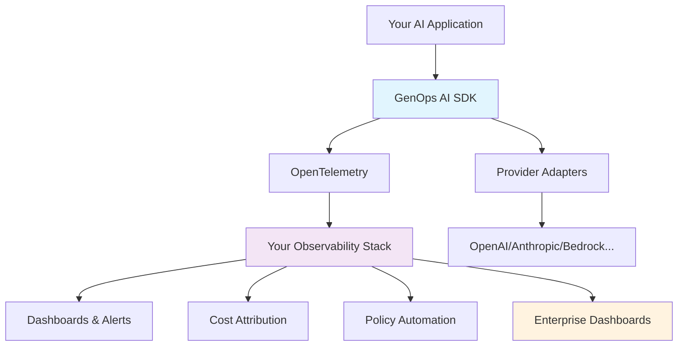

<p align="center">
  
</p>

# 🧭 GenOps: Open Runtime Governance for AI Systems

GenOps is an open-source runtime governance framework for AI and LLM workloads — built on [OpenTelemetry](https://opentelemetry.io) and FinOps standards.

It provides cost, policy, and compliance telemetry across your AI stack, enabling teams to:

- **Track spend and efficiency** across models, teams, and customers
- **Enforce usage policies** and model governance in real time  
- **Integrate with existing** observability, billing, and compliance systems

Because GenOps emits standard OpenTelemetry traces, logs, and metrics, it plugs directly into your existing monitoring, FinOps, and policy infrastructure.

<div align="center">
  
  [](https://github.com/KoshiHQ/GenOps-AI/stargazers)
  [](https://github.com/KoshiHQ/GenOps-AI/actions)  
  [](https://badge.fury.io/py/genops)
  [](https://opensource.org/licenses/Apache-2.0)
  [](https://www.python.org/downloads/)
  [](https://github.com/astral-sh/ruff)
  [](https://opentelemetry.io/)

</div>

---

## 📡 Supported Destinations

GenOps exports standardized telemetry and governance events to your existing stack.

### Observability & Monitoring

✅ [OpenTelemetry Collector](https://opentelemetry.io/docs/collector/)  
✅ [Datadog](https://www.datadoghq.com/)  
✅ [Grafana](https://grafana.com/) / [Loki](https://grafana.com/oss/loki/)  
✅ [Honeycomb](https://www.honeycomb.io/)  
✅ [Prometheus](https://prometheus.io/) / [SigNoz](https://signoz.io/)  
✅ [New Relic](https://newrelic.com/)  
✅ [Jaeger](https://www.jaegertracing.io/)  
✅ [Tempo](https://grafana.com/oss/tempo/)  

### Cost & FinOps Platforms

✅ [OpenCost](https://www.opencost.io/)  
☐ [Finout](https://www.finout.io/) / [CloudZero](https://www.cloudzero.com/)  
☐ [AWS Cost Explorer](https://aws.amazon.com/aws-cost-management/) / [GCP Billing](https://cloud.google.com/billing/docs) / [Azure Cost Management](https://azure.microsoft.com/en-us/products/cost-management/)  
☐ [Cloudflare Workers AI Analytics](https://developers.cloudflare.com/workers-ai/)  
✅ [Traceloop](https://traceloop.com/) / [OpenLLMetry](https://github.com/traceloop/openllmetry)  

### Policy & Compliance

☐ [OPA (Open Policy Agent)](https://www.openpolicyagent.org/)  
☐ [Kyverno](https://kyverno.io/)  
☐ [Cloud Custodian](https://cloudcustodian.io/)  
☐ [HashiCorp Sentinel](https://www.hashicorp.com/sentinel)  
☐ Rego-compatible policies  

### Data & Security Pipelines

☐ [BigQuery](https://cloud.google.com/bigquery) / [Snowflake](https://www.snowflake.com/)  
☐ [S3](https://aws.amazon.com/s3/) / [GCS](https://cloud.google.com/storage) / [Azure Blob](https://azure.microsoft.com/en-us/products/storage/blobs/)  
☐ [Splunk](https://www.splunk.com/) / [Elastic](https://www.elastic.co/)  

---

## 🔌 Supported Integrations

GenOps integrates natively with your AI and infrastructure layer to collect and normalize runtime signals.

### LLM & Model Providers

✅ [OpenAI](https://openai.com/) / [Azure OpenAI](https://azure.microsoft.com/en-us/products/ai-services/openai-service)  
✅ [Anthropic](https://www.anthropic.com/)  
✅ [OpenRouter](https://openrouter.ai/) (Multi-provider routing)  
☐ [Mistral](https://mistral.ai/) / [Lepton](https://www.lepton.ai/)  
☐ [Gemini](https://deepmind.google/technologies/gemini/) (Google)  
☐ [Ollama](https://ollama.com/) / Local Models  
☐ [Bedrock](https://aws.amazon.com/bedrock/) / [SageMaker](https://aws.amazon.com/sagemaker/) (AWS)  
☐ [Replicate](https://replicate.com/) / [Together](https://www.together.ai/) / [Groq](https://groq.com/)  

### Frameworks & Tooling

✅ [LangChain](https://python.langchain.com/) (Comprehensive integration)  
☐ [LlamaIndex](https://www.llamaindex.ai/)  
☐ [LiteLLM](https://litellm.vercel.app/)  
☐ [DSPy](https://dspy-docs.vercel.app/) / [Guidance](https://github.com/guidance-ai/guidance)  
☐ [CrewAI](https://www.crewai.com/) / OpenAI Agents  
☐ [Haystack](https://haystack.deepset.ai/)  
☐ [LangGraph](https://langchain-ai.github.io/langgraph/) / [Langflow](https://www.langflow.org/)  

### Infrastructure & Runtime

☐ [Kubernetes](https://kubernetes.io/) (K8s)  
☐ [Cloudflare Workers](https://workers.cloudflare.com/) / [Vercel AI SDK](https://sdk.vercel.ai/)  
☐ [Ray](https://www.ray.io/) / [Modal](https://modal.com/) / [Fly.io](https://fly.io/)  
☐ Serverless runtimes ([Lambda](https://aws.amazon.com/lambda/), [Cloud Run](https://cloud.google.com/run), [Functions](https://azure.microsoft.com/en-us/products/functions/))  

---

## 🧠 What Do We Govern?

GenOps standardizes and enforces runtime governance across your AI systems.

| **Dimension** | **Example Metrics / Policies** | **Purpose** |
|---------------|----------------------------------|-------------|
| **Cost Telemetry** | Cost per request, team, feature, or customer | Enables FinOps visibility and chargeback |
| **Policy Compliance** | Allowed models, region routing, rate limits | Prevents policy drift and shadow usage |
| **Data Residency** | Model invocation region, storage compliance | Ensures GDPR / SOC2 / FedRAMP adherence |
| **Performance Metrics** | Latency, cache hits, throughput | Optimizes efficiency and reliability |
| **Safety & Guardrails** | Toxicity filters, jailbreak detection | Enforces responsible deployment |
| **Usage Attribution** | Project, user, and customer-level metering | Enables cross-org accountability |

---

## 🧩 Example Architecture

```
Your App
   │
   ▼
GenOps SDK (instrumentation + policy hooks)
   │
   ├──> OpenTelemetry Exporter → Datadog / Grafana / Collector
   ├──> Policy Engine (OPA / WASM)
   └──> Cost & Compliance Store (Snowflake / BigQuery)
```

---

## 🚀 Quick Start

### 1. Install the SDK
```bash
pip install genops
```

### 2. Initialize in your app
```python
from genops import GenOps
GenOps.init()
```

### 3. Run your app
GenOps automatically collects runtime telemetry and governance signals.  
View data in your existing observability stack or policy engine.

---

## 🚨 **The Problem: AI Costs Are Out of Control**

**Real scenarios happening right now:**
- 💸 **$50,000 surprise bills** - One customer's chat feature cost 10x more than expected
- 🔍 **No visibility** - "Which team/feature is burning through our AI budget?"  
- 🚫 **No guardrails** - Production systems calling GPT-4 when GPT-3.5 would work
- 📊 **CFO questions** - "How much is AI costing us per customer?"
- ⚖️ **Compliance gaps** - No audit trail for AI decisions in regulated industries

**Without governance, AI is just expensive magic.** ✨💸

### 👥 **Who This Is For**

- **DevOps Teams**: "I need AI costs in my existing dashboards"
- **FinOps Teams**: "I need per-customer AI cost allocation"  
- **Platform Teams**: "I need budget controls before we go bankrupt"
- **Compliance Teams**: "I need audit trails for AI decisions"
- **CTOs**: "I need to understand what we're actually paying for"

---

## ✨ **Key Features**

### 🚀 **Provider Instrumentation** (Production-Ready)
```python
from genops.providers.openai import instrument_openai

# Instrument OpenAI with automatic governance tracking
client = instrument_openai(api_key="your-openai-key")

# All calls now include cost, token, and governance telemetry
response = client.chat_completions_create(
    model="gpt-4",
    messages=[{"role": "user", "content": "Hello!"}],
    # Governance attributes
    team="support-team",
    project="ai-assistant", 
    customer_id="enterprise-123"
)
# ✅ Cost, tokens, policies automatically tracked and exported via OpenTelemetry
```

### 🎛️ **Manual Telemetry Tracking** 
```python
from genops.core.telemetry import GenOpsTelemetry

telemetry = GenOpsTelemetry()

# Track any operation with governance context
with telemetry.trace_operation(
    operation_name="customer_support",
    team="support-team",
    project="ai-chatbot",
    customer_id="customer_123"
) as span:
    # Your AI processing logic
    ai_response = call_your_ai_model(message)
    
    # Record governance telemetry
    telemetry.record_cost(span, cost=0.05, provider="openai", model="gpt-3.5-turbo")
    telemetry.record_evaluation(span, metric_name="quality", score=0.92)

# Governance data automatically flows to your observability stack via OpenTelemetry
```

### 🛡️ **Policy Enforcement**
```python
from genops.core.policy import register_policy, PolicyResult, _policy_engine

# Register governance policies  
register_policy(
    name="cost_limit",
    enforcement_level=PolicyResult.BLOCKED,
    conditions={"max_cost": 5.00}
)

# Evaluate policies before operations
def safe_ai_operation(prompt: str, estimated_cost: float):
    # Check policy before operation
    result = _policy_engine.evaluate_policy("cost_limit", {"cost": estimated_cost})
    
    if result.result == PolicyResult.BLOCKED:
        raise Exception(f"Policy violation: {result.reason}")
    
    return call_ai_model(prompt)  # Proceeds if policy allows
```

### 📊 **Rich Governance Telemetry**
```python
from genops.core.telemetry import GenOpsTelemetry

telemetry = GenOpsTelemetry()

with telemetry.trace_operation(operation_name="document_analysis") as span:
    # AI processing...
    ai_result = process_document()
    
    # Record comprehensive governance signals
    telemetry.record_cost(span, cost=2.50, currency="USD", provider="openai")
    telemetry.record_policy(span, policy_name="content_safety", result="allowed") 
    telemetry.record_evaluation(span, metric_name="quality_score", score=0.92)
    telemetry.record_budget(span, budget_name="monthly_ai_spend", allocated=1000, consumed=150)
```

---

## 🚀 **Quick Start**

### Installation

```bash
pip install genops

# With AI provider support
pip install "genops[openai,anthropic]"  # For OpenAI + Anthropic
pip install "genops[all]"               # All providers
```

### ⚡ **30-Second Test**

Verify your installation works:

```bash
# Test the CLI
genops --version

# Quick Python test
python -c "import genops; print('✅ GenOps AI installed successfully!')"
```

### 5-Minute Governance Setup

```python
from genops.providers.openai import instrument_openai
import genops

# 1. Set default attribution (once at app startup)
genops.set_default_attributes(
    team="platform-engineering",
    project="ai-services", 
    environment="production"
)

# 2. Instrument your AI providers  
client = instrument_openai(api_key="your-openai-key")

# 3. Use normally - defaults inherited automatically
response = client.chat_completions_create(
    model="gpt-3.5-turbo",
    messages=[{"role": "user", "content": "Hello!"}],
    # Only specify what's unique to this operation
    customer_id="enterprise-123",
    feature="chat-assistant"
    # team, project, environment automatically included!
)

# 4. OpenTelemetry exports complete attribution data
# ✅ Cost, tokens, team, customer, feature → Your observability platform
```

**That's it!** Full governance telemetry with intelligent attribution inheritance.

### 🎯 **Real-World Governance Scenarios**

See complete end-to-end examples that solve real business problems:

```bash
# 🚨 Prevent AI budget overruns with automatic enforcement
python examples/governance_scenarios/budget_enforcement.py

# 🛡️ Block inappropriate content with real-time filtering  
python examples/governance_scenarios/content_filtering.py

# 📊 Track AI costs per customer for usage-based billing
python examples/governance_scenarios/customer_attribution.py
```

Each scenario shows working code with realistic business problems and governance solutions.

---

## 📖 **Core Concepts**

### **Governance Semantics**
GenOps extends OpenTelemetry with standardized governance attributes:

- **`genops.cost.*`** - Cost attribution and financial tracking
- **`genops.policy.*`** - Policy enforcement results and violations  
- **`genops.eval.*`** - Quality, safety, and performance evaluations
- **`genops.budget.*`** - Spend tracking and limit management

### **Provider Adapters** 
Pre-built integrations with accurate cost models:

- ✅ **OpenAI** (GPT-3.5, GPT-4, GPT-4-turbo) with per-token pricing
- ✅ **Anthropic** (Claude-3 Sonnet, Opus, Haiku) with accurate costs
- 🚧 **AWS Bedrock** (coming soon)
- 🚧 **Google Gemini** (coming soon)
- 🚧 **LangChain** (coming soon) 
- 🚧 **LlamaIndex** (coming soon)

### **Observability Stack Integration**
Works with your existing tools:

- 📊 **Datadog, Honeycomb, New Relic** - OTLP export
- 📈 **Grafana Tempo, Jaeger** - Distributed tracing
- 🔍 **Elasticsearch, Splunk** - Log aggregation
- ☁️ **AWS X-Ray, Google Cloud Trace** - Cloud-native tracing

---

## 🏗️ **Architecture**



**GenOps AI sits alongside OpenLLMetry** in your telemetry stack, adding the governance layer that turns observability data into business accountability.

---

## 🎭 **Usage Examples**

### **Multi-Provider Cost Attribution**
```python
import genops

# Initialize with default governance context
genops.init(default_team="ai-research", default_project="multimodal")

# Use different providers - all automatically tracked
import openai
import anthropic

# OpenAI for quick tasks
openai_response = openai.chat.completions.create(
    model="gpt-3.5-turbo",
    messages=[{"role": "user", "content": "Summarize this"}],
    # Inherits team/project, adds specific context
    customer_id="enterprise_123", 
    feature="document_summary"
)

# Anthropic for complex reasoning
anthropic_client = anthropic.Anthropic()
claude_response = anthropic_client.messages.create(
    model="claude-3-opus-20240229", 
    max_tokens=2048,
    messages=[{"role": "user", "content": "Analyze this data"}],
    # Different feature, same customer
    customer_id="enterprise_123",
    feature="data_analysis"  
)

# All operations tagged with cost, provider, customer, feature
# Perfect for FinOps dashboards and customer billing
```

### **Policy-Driven Governance**
```python
import genops
from genops import register_policy, PolicyResult

# Set up governance policies
register_policy("cost_limit", max_cost=10.0, enforcement_level=PolicyResult.BLOCKED)
register_policy("content_safety", blocked_patterns=["violence"], enforcement_level=PolicyResult.WARNING)
register_policy("team_budget", max_monthly_spend=5000, enforcement_level=PolicyResult.RATE_LIMITED)

# Apply policies to operations
def generate_content(prompt: str, customer_tier: str):
    from genops.core.policy import _policy_engine, PolicyViolationError
    
    if customer_tier == "enterprise":
        model = "gpt-4"
        estimated_cost = 0.12  # Higher cost estimate
    else:
        model = "gpt-3.5-turbo"
        estimated_cost = 0.03
    
    # Check policies before operation
    context = {"cost": estimated_cost, "content": prompt}
    cost_result = _policy_engine.evaluate_policy("cost_limit", context)
    
    if cost_result.result == PolicyResult.BLOCKED:
        raise PolicyViolationError("cost_limit", cost_result.reason)
        
    return call_ai_model(model, prompt)

# Policy evaluation with error handling
try:
    result = generate_content("Write a story", "enterprise") 
    # ✅ Allowed: cost under $10, content safe
except PolicyViolationError as e:
    # ❌ Blocked: policy violation with detailed context
    logger.warning(f"Policy {e.policy_name}: {e.reason}")
```

### **Custom Evaluations & Compliance**
```python
from genops.core.telemetry import GenOpsTelemetry

def moderate_content(text: str):
    telemetry = GenOpsTelemetry()
    
    with telemetry.trace_operation(operation_name="content_moderation") as span:
        # Your content moderation logic
        safety_score = run_safety_model(text)
        toxicity_score = check_toxicity(text)
        
        # Record compliance metrics
        telemetry.record_evaluation(span, metric_name="safety", score=safety_score, 
                                   threshold=0.8, passed=safety_score > 0.8)
        telemetry.record_evaluation(span, metric_name="toxicity", score=toxicity_score,
                                   threshold=0.2, passed=toxicity_score < 0.2) 
        
        # Policy decision
        if safety_score > 0.8 and toxicity_score < 0.2:
            telemetry.record_policy(span, policy_name="content_policy", result="approved")
            return {"approved": True, "reason": "Content meets safety standards"}
        else:
            telemetry.record_policy(span, policy_name="content_policy", result="rejected", 
                                   reason="Safety threshold not met")
            return {"approved": False, "reason": "Content violates policy"}

# Rich governance telemetry automatically exported for audit trails
```

### **Budget Tracking & Alerts**  
```python
from genops.core.telemetry import GenOpsTelemetry

def process_customer_requests(customer_id: str, requests: list):
    telemetry = GenOpsTelemetry()
    
    # Track budget utilization per customer
    with telemetry.trace_operation(f"customer_{customer_id}_processing") as span:
        total_cost = 0
        
        for request in requests:
            response = process_with_ai(request)
            request_cost = calculate_cost(response)
            total_cost += request_cost
            
        # Update customer budget tracking
        customer_budget = get_customer_budget(customer_id)
        remaining = customer_budget.limit - customer_budget.used - total_cost
        
        telemetry.record_budget(
            span=span,
            budget_name=f"customer_{customer_id}_monthly",
            allocated=customer_budget.limit,
            consumed=customer_budget.used + total_cost, 
            remaining=remaining
        )
        
        # Automatic alerts when budget utilization > 80%
        if remaining / customer_budget.limit < 0.2:
            telemetry.record_policy(span, policy_name="budget_warning", result="triggered", 
                                   reason=f"Customer {customer_id} at 80% budget utilization")
```

---

## 🏢 **Production Ready**

### **Compliance & Audit Trails**
GenOps AI automatically creates detailed audit logs for:
- **Cost attribution** with exact token counts and pricing models
- **Policy decisions** with enforcement context and reasoning
- **Data flow tracking** for privacy and compliance requirements  
- **Model usage patterns** for governance and risk management

### **Observability Integration**
Works with your existing tools and workflows:
- **Per-customer cost allocation** for accurate billing
- **Team and department spend tracking** for budget management
- **Feature-level cost analysis** for product decisions
- **Model efficiency metrics** for optimization opportunities
- **Real-time dashboards** using your current observability platform

---

## 🤝 **Community & Support**

### **Contributing**
We welcome contributions! See [CONTRIBUTING.md](CONTRIBUTING.md) for:
- Development setup and testing guidelines
- Code standards and review process
- Community guidelines and code of conduct

### **Getting Help**
- 📖 **Documentation**: [GitHub Docs](https://github.com/KoshiHQ/GenOps-AI/tree/main/docs)
- 💬 **Discussions**: [GitHub Discussions](https://github.com/KoshiHQ/GenOps-AI/discussions)
- 🐛 **Issues**: [GitHub Issues](https://github.com/KoshiHQ/GenOps-AI/issues)

### **Roadmap**
See our [public roadmap](https://github.com/KoshiHQ/GenOps-AI/projects) for upcoming features:
- 🚧 AWS Bedrock and Google Gemini adapters
- 🚧 LangChain and LlamaIndex integrations  
- 🚧 OpenTelemetry Collector processors for real-time governance
- 🚧 Pre-built dashboards for major observability platforms

---

## 📄 **License**

Licensed under the Apache License, Version 2.0. See [LICENSE](LICENSE) for details.

---

## 🌟 **Why GenOps AI?**

**Traditional AI monitoring tells you what happened. GenOps AI tells you what it cost, who did it, whether it should have been allowed, and how well it worked.**

- **For DevOps Teams**: Integrate AI governance into existing observability workflows
- **For FinOps Teams**: Get precise cost attribution and budget controls
- **For Compliance Teams**: Automated policy enforcement with audit trails
- **For Product Teams**: Feature-level AI cost analysis and optimization insights

**Open source, OpenTelemetry-native, and designed to work with your existing stack.**

---

## 🤝 **Community & Quick Wins**

**New to open source?** Start here:
- 🐛 [Good first issues](https://github.com/KoshiHQ/GenOps-AI/issues?q=is%3Aissue+is%3Aopen+label%3A%22good+first+issue%22) - Perfect for newcomers
- 📚 [Documentation improvements](https://github.com/KoshiHQ/GenOps-AI/issues?q=is%3Aissue+is%3Aopen+label%3Adocumentation) - Help others learn
- 🔧 [Help fix our CI tests!](https://github.com/KoshiHQ/GenOps-AI/issues?q=is%3Aissue+is%3Aopen+label%3Aci-fix) - Great for contributors who love debugging

**5-minute contributions welcome!** Every small improvement helps the community grow.

**Looking for bigger challenges?**
- 🏗️ [Provider integrations](https://github.com/KoshiHQ/GenOps-AI/issues?q=is%3Aissue+is%3Aopen+label%3Aprovider) - Add AWS Bedrock, Google Gemini support
- 📊 [Dashboard templates](https://github.com/KoshiHQ/GenOps-AI/issues?q=is%3Aissue+is%3Aopen+label%3Adashboard) - Pre-built observability dashboards
- 🤖 [AI governance patterns](https://github.com/KoshiHQ/GenOps-AI/issues?q=is%3Aissue+is%3Aopen+label%3Agovernance) - Real-world scenarios

---

## ⚠️ **Known Issues & Contributing**

This is a **preview release** with comprehensive features but some ongoing CI test issues:

### 🚧 Current Status
- ✅ **Core functionality working**: Security scans pass, package installation works
- ✅ **Comprehensive examples**: All governance scenarios and integrations functional
- ⚠️ **Some CI tests failing**: Integration tests and Python 3.11 compatibility
- 🤝 **Community help wanted**: [See open issues](https://github.com/KoshiHQ/GenOps-AI/issues) for contribution opportunities

### 🆘 Need Help?
- 💬 **Questions**: [GitHub Discussions](https://github.com/KoshiHQ/GenOps-AI/discussions)
- 🐛 **Issues**: [GitHub Issues](https://github.com/KoshiHQ/GenOps-AI/issues)
- 🤝 **Contributing**: [Contributing Guide](CONTRIBUTING.md)

---

## ✨ Contributors

Thanks goes to these wonderful people who have contributed to GenOps AI:

<!-- ALL-CONTRIBUTORS-LIST:START - Do not remove or modify this section -->
<!-- prettier-ignore-start -->
<!-- markdownlint-disable -->
<!-- markdownlint-restore -->
<!-- prettier-ignore-end -->
<!-- ALL-CONTRIBUTORS-LIST:END -->

This project follows the [all-contributors](https://github.com/all-contributors/all-contributors) specification. Contributions of any kind welcome!

---

## 🏷️ **Trademark & Brand Guidelines**

### **GenOps AI Trademark Usage**

The "GenOps AI" name and associated branding are trademarks used to identify this project and its official implementations.

**✅ Acceptable Use:**
- Referring to this project in documentation, blog posts, or presentations
- Building integrations or extensions that work with GenOps AI
- Using "Built with GenOps AI" or "Powered by GenOps AI" attributions
- Community projects that extend or integrate with GenOps AI functionality

**❌ Prohibited Use:**
- Using "GenOps" in the name of competing commercial AI governance products
- Creating confusion about official vs. community implementations  
- Using GenOps branding for unrelated products or services
- Implying official endorsement without permission

**📄 License Note:** The GenOps AI code is licensed under Apache 2.0, but trademark rights are separate from code rights. You're free to use, modify, and distribute the code under Apache 2.0, but please respect our trademark guidelines when naming your projects or products.

For questions about trademark usage, please open an issue or contact the maintainers.

---

## 📄 **Legal & Licensing**

- **Code License**: [Apache License 2.0](LICENSE) - Permissive open source license
- **Contributor Agreement**: All contributions require [DCO sign-off](CONTRIBUTING.md#developer-certificate-of-origin-dco)
- **Copyright**: Copyright © 2024 GenOps AI Contributors
- **Trademark**: "GenOps AI" and associated marks are trademarks of the project maintainers

---

<div align="center">
  <p><strong>Ready to bring governance to your AI systems?</strong></p>
  
  ```bash
  pip install genops
  ```
  
  <p>⭐ <strong>Star us on GitHub</strong> if you find GenOps AI useful!</p>
  
  [](https://github.com/KoshiHQ/GenOps-AI/stargazers)
</div>