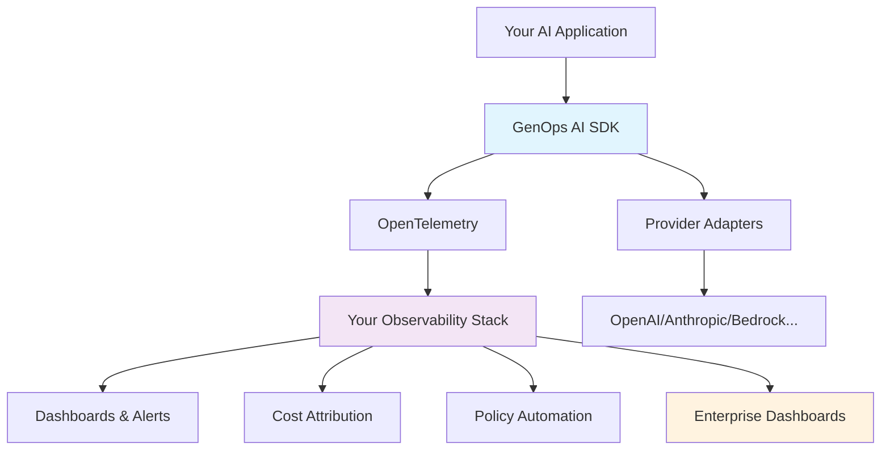

# GenOps AI

<div align="center">
  <h3>OpenTelemetry-native governance for AI systems</h3>
  <p><em>Turn AI telemetry into actionable accountability</em></p>
  
  [](https://github.com/KoshiHQ/GenOps-AI/stargazers)
  [](https://opensource.org/licenses/Apache-2.0)
  [](https://www.python.org/downloads/)
  [](https://opentelemetry.io/)
</div>

---

## 🎯 **What is GenOps AI?**

GenOps AI is an **open-source governance framework** that brings cost attribution, policy enforcement, and compliance automation to AI systems using **OpenTelemetry standards**.

While [OpenLLMetry](https://github.com/traceloop/openllmetry) tells you *what* your AI is doing (prompts, completions, tokens), **GenOps AI tells you *why and how* — with governance telemetry** that enables:

- 💰 **Cost Attribution** across teams, projects, features, and customers
- 🛡️ **Policy Enforcement** with configurable limits and content filtering  
- 📊 **Budget Tracking** with automated alerts and spend controls
- 🔍 **Compliance Automation** with evaluation metrics and audit trails
- 🏢 **Enterprise Governance** feeding dashboards, FinOps, and control planes

**Built alongside OpenLLMetry, interoperable by design, independent by governance.**

---

## ✨ **Key Features**

### 🚀 **Provider Instrumentation** (Production-Ready)
```python
from genops.providers.openai import instrument_openai

# Instrument OpenAI with automatic governance tracking
client = instrument_openai(api_key="your-openai-key")

# All calls now include cost, token, and governance telemetry
response = client.chat_completions_create(
    model="gpt-4",
    messages=[{"role": "user", "content": "Hello!"}],
    # Governance attributes
    team="support-team",
    project="ai-assistant", 
    customer_id="enterprise-123"
)
# ✅ Cost, tokens, policies automatically tracked and exported via OpenTelemetry
```

### 🎛️ **Manual Telemetry Tracking** 
```python
from genops.core.telemetry import GenOpsTelemetry

telemetry = GenOpsTelemetry()

# Track any operation with governance context
with telemetry.trace_operation(
    operation_name="customer_support",
    team="support-team",
    project="ai-chatbot",
    customer_id="customer_123"
) as span:
    # Your AI processing logic
    ai_response = call_your_ai_model(message)
    
    # Record governance telemetry
    telemetry.record_cost(span, cost=0.05, provider="openai", model="gpt-3.5-turbo")
    telemetry.record_evaluation(span, metric_name="quality", score=0.92)

# Governance data automatically flows to your observability stack via OpenTelemetry
```

### 🛡️ **Policy Enforcement**
```python
from genops.core.policy import register_policy, PolicyResult, _policy_engine

# Register governance policies  
register_policy(
    name="cost_limit",
    enforcement_level=PolicyResult.BLOCKED,
    conditions={"max_cost": 5.00}
)

# Evaluate policies before operations
def safe_ai_operation(prompt: str, estimated_cost: float):
    # Check policy before operation
    result = _policy_engine.evaluate_policy("cost_limit", {"cost": estimated_cost})
    
    if result.result == PolicyResult.BLOCKED:
        raise Exception(f"Policy violation: {result.reason}")
    
    return call_ai_model(prompt)  # Proceeds if policy allows
```

### 📊 **Rich Governance Telemetry**
```python
from genops.core.telemetry import GenOpsTelemetry

telemetry = GenOpsTelemetry()

with telemetry.trace_operation(operation_name="document_analysis") as span:
    # AI processing...
    ai_result = process_document()
    
    # Record comprehensive governance signals
    telemetry.record_cost(span, cost=2.50, currency="USD", provider="openai")
    telemetry.record_policy(span, policy_name="content_safety", result="allowed") 
    telemetry.record_evaluation(span, metric_name="quality_score", score=0.92)
    telemetry.record_budget(span, budget_name="monthly_ai_spend", allocated=1000, consumed=150)
```

---

## 🚀 **Quick Start**

### Installation

```bash
pip install genops

# With AI provider support
pip install "genops[openai,anthropic]"  # For OpenAI + Anthropic
pip install "genops[all]"               # All providers
```

### 5-Minute Governance Setup

```python
from genops.providers.openai import instrument_openai
import genops

# 1. Set default attribution (once at app startup)
genops.set_default_attributes(
    team="platform-engineering",
    project="ai-services", 
    environment="production"
)

# 2. Instrument your AI providers  
client = instrument_openai(api_key="your-openai-key")

# 3. Use normally - defaults inherited automatically
response = client.chat_completions_create(
    model="gpt-3.5-turbo",
    messages=[{"role": "user", "content": "Hello!"}],
    # Only specify what's unique to this operation
    customer_id="enterprise-123",
    feature="chat-assistant"
    # team, project, environment automatically included!
)

# 4. OpenTelemetry exports complete attribution data
# ✅ Cost, tokens, team, customer, feature → Your observability platform
```

**That's it!** Full governance telemetry with intelligent attribution inheritance.

### 🎯 **Real-World Governance Scenarios**

See complete end-to-end examples that solve real business problems:

```bash
# 🚨 Prevent AI budget overruns with automatic enforcement
python examples/governance_scenarios/budget_enforcement.py

# 🛡️ Block inappropriate content with real-time filtering  
python examples/governance_scenarios/content_filtering.py

# 📊 Track AI costs per customer for usage-based billing
python examples/governance_scenarios/customer_attribution.py
```

Each scenario shows working code with realistic business problems and governance solutions.

---

## 📖 **Core Concepts**

### **Governance Semantics**
GenOps extends OpenTelemetry with standardized governance attributes:

- **`genops.cost.*`** - Cost attribution and financial tracking
- **`genops.policy.*`** - Policy enforcement results and violations  
- **`genops.eval.*`** - Quality, safety, and performance evaluations
- **`genops.budget.*`** - Spend tracking and limit management

### **Provider Adapters** 
Pre-built integrations with accurate cost models:

- ✅ **OpenAI** (GPT-3.5, GPT-4, GPT-4-turbo) with per-token pricing
- ✅ **Anthropic** (Claude-3 Sonnet, Opus, Haiku) with accurate costs
- 🚧 **AWS Bedrock** (coming soon)
- 🚧 **Google Gemini** (coming soon)
- 🚧 **LangChain** (coming soon) 
- 🚧 **LlamaIndex** (coming soon)

### **Observability Stack Integration**
Works with your existing tools:

- 📊 **Datadog, Honeycomb, New Relic** - OTLP export
- 📈 **Grafana Tempo, Jaeger** - Distributed tracing
- 🔍 **Elasticsearch, Splunk** - Log aggregation
- ☁️ **AWS X-Ray, Google Cloud Trace** - Cloud-native tracing

---

## 🏗️ **Architecture**



**GenOps AI sits alongside OpenLLMetry** in your telemetry stack, adding the governance layer that turns observability data into business accountability.

---

## 🎭 **Usage Examples**

### **Multi-Provider Cost Attribution**
```python
import genops

# Initialize with default governance context
genops.init(default_team="ai-research", default_project="multimodal")

# Use different providers - all automatically tracked
import openai
import anthropic

# OpenAI for quick tasks
openai_response = openai.chat.completions.create(
    model="gpt-3.5-turbo",
    messages=[{"role": "user", "content": "Summarize this"}],
    # Inherits team/project, adds specific context
    customer_id="enterprise_123", 
    feature="document_summary"
)

# Anthropic for complex reasoning
anthropic_client = anthropic.Anthropic()
claude_response = anthropic_client.messages.create(
    model="claude-3-opus-20240229", 
    max_tokens=2048,
    messages=[{"role": "user", "content": "Analyze this data"}],
    # Different feature, same customer
    customer_id="enterprise_123",
    feature="data_analysis"  
)

# All operations tagged with cost, provider, customer, feature
# Perfect for FinOps dashboards and customer billing
```

### **Policy-Driven Governance**
```python
import genops
from genops import register_policy, PolicyResult

# Set up governance policies
register_policy("cost_limit", max_cost=10.0, enforcement_level=PolicyResult.BLOCKED)
register_policy("content_safety", blocked_patterns=["violence"], enforcement_level=PolicyResult.WARNING)
register_policy("team_budget", max_monthly_spend=5000, enforcement_level=PolicyResult.RATE_LIMITED)

# Apply policies to operations
def generate_content(prompt: str, customer_tier: str):
    from genops.core.policy import _policy_engine, PolicyViolationError
    
    if customer_tier == "enterprise":
        model = "gpt-4"
        estimated_cost = 0.12  # Higher cost estimate
    else:
        model = "gpt-3.5-turbo"
        estimated_cost = 0.03
    
    # Check policies before operation
    context = {"cost": estimated_cost, "content": prompt}
    cost_result = _policy_engine.evaluate_policy("cost_limit", context)
    
    if cost_result.result == PolicyResult.BLOCKED:
        raise PolicyViolationError("cost_limit", cost_result.reason)
        
    return call_ai_model(model, prompt)

# Policy evaluation with error handling
try:
    result = generate_content("Write a story", "enterprise") 
    # ✅ Allowed: cost under $10, content safe
except PolicyViolationError as e:
    # ❌ Blocked: policy violation with detailed context
    logger.warning(f"Policy {e.policy_name}: {e.reason}")
```

### **Custom Evaluations & Compliance**
```python
from genops.core.telemetry import GenOpsTelemetry

def moderate_content(text: str):
    telemetry = GenOpsTelemetry()
    
    with telemetry.trace_operation(operation_name="content_moderation") as span:
        # Your content moderation logic
        safety_score = run_safety_model(text)
        toxicity_score = check_toxicity(text)
        
        # Record compliance metrics
        telemetry.record_evaluation(span, metric_name="safety", score=safety_score, 
                                   threshold=0.8, passed=safety_score > 0.8)
        telemetry.record_evaluation(span, metric_name="toxicity", score=toxicity_score,
                                   threshold=0.2, passed=toxicity_score < 0.2) 
        
        # Policy decision
        if safety_score > 0.8 and toxicity_score < 0.2:
            telemetry.record_policy(span, policy_name="content_policy", result="approved")
            return {"approved": True, "reason": "Content meets safety standards"}
        else:
            telemetry.record_policy(span, policy_name="content_policy", result="rejected", 
                                   reason="Safety threshold not met")
            return {"approved": False, "reason": "Content violates policy"}

# Rich governance telemetry automatically exported for audit trails
```

### **Budget Tracking & Alerts**  
```python
from genops.core.telemetry import GenOpsTelemetry

def process_customer_requests(customer_id: str, requests: list):
    telemetry = GenOpsTelemetry()
    
    # Track budget utilization per customer
    with telemetry.trace_operation(f"customer_{customer_id}_processing") as span:
        total_cost = 0
        
        for request in requests:
            response = process_with_ai(request)
            request_cost = calculate_cost(response)
            total_cost += request_cost
            
        # Update customer budget tracking
        customer_budget = get_customer_budget(customer_id)
        remaining = customer_budget.limit - customer_budget.used - total_cost
        
        telemetry.record_budget(
            span=span,
            budget_name=f"customer_{customer_id}_monthly",
            allocated=customer_budget.limit,
            consumed=customer_budget.used + total_cost, 
            remaining=remaining
        )
        
        # Automatic alerts when budget utilization > 80%
        if remaining / customer_budget.limit < 0.2:
            telemetry.record_policy(span, policy_name="budget_warning", result="triggered", 
                                   reason=f"Customer {customer_id} at 80% budget utilization")
```

---

## 🏢 **Enterprise & Production**

### **Compliance & Audit Trails**
GenOps AI automatically creates detailed audit logs for:
- **Cost attribution** with exact token counts and pricing models
- **Policy decisions** with enforcement context and reasoning
- **Data flow tracking** for privacy and compliance requirements  
- **Model usage patterns** for governance and risk management

### **FinOps Integration**
Perfect for financial operations teams:
- **Per-customer cost allocation** for accurate billing
- **Department/team spend tracking** for budget management
- **Feature-level cost analysis** for product decisions
- **Model efficiency metrics** for optimization opportunities

### **Enterprise Integration**
GenOps AI telemetry can be exported to your existing observability stack:
- **Real-time dashboards** for executives and compliance teams
- **Automated policy management** across multiple teams and projects  
- **Advanced analytics** for cost optimization and risk management
- **Enterprise-grade security** for governance at scale

---

## 🤝 **Community & Support**

### **Contributing**
We welcome contributions! See [CONTRIBUTING.md](CONTRIBUTING.md) for:
- Development setup and testing guidelines
- Code standards and review process
- Community guidelines and code of conduct

### **Getting Help**
- 📖 **Documentation**: [docs.genopsai.org](https://docs.genopsai.org)
- 💬 **Discussions**: [GitHub Discussions](https://github.com/KoshiHQ/GenOps-AI/discussions)
- 🐛 **Issues**: [GitHub Issues](https://github.com/KoshiHQ/GenOps-AI/issues)
- 📧 **Email**: [hello@genopsai.org](mailto:hello@genopsai.org)

### **Roadmap**
See our [public roadmap](https://github.com/KoshiHQ/GenOps-AI/projects) for upcoming features:
- 🚧 AWS Bedrock and Google Gemini adapters
- 🚧 LangChain and LlamaIndex integrations  
- 🚧 OpenTelemetry Collector processors for real-time governance
- 🚧 Pre-built dashboards for major observability platforms

---

## 📄 **License**

Licensed under the Apache License, Version 2.0. See [LICENSE](LICENSE) for details.

---

## 🌟 **Why GenOps AI?**

**Traditional AI monitoring tells you what happened. GenOps AI tells you what it cost, who did it, whether it should have been allowed, and how well it worked.**

- **For DevOps Teams**: Integrate AI governance into existing observability workflows
- **For FinOps Teams**: Get precise cost attribution and budget controls
- **For Compliance Teams**: Automated policy enforcement with audit trails
- **For Product Teams**: Feature-level AI cost analysis and optimization insights
- **For Executives**: Enterprise-wide AI governance visibility and control

**Start with the open-source GenOps AI SDK. Scale with your existing enterprise observability platform.**

---

<div align="center">
  <p><strong>Ready to bring governance to your AI systems?</strong></p>
  
  ```bash
  pip install genops
  ```
  
  <p>⭐ <strong>Star us on GitHub</strong> if you find GenOps AI useful!</p>
  
  [](https://github.com/KoshiHQ/GenOps-AI/stargazers)
</div>