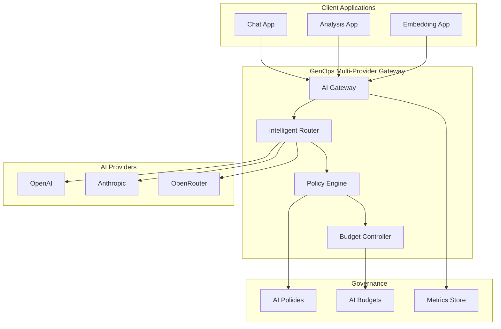

# Multi-Provider AI Kubernetes Deployment

Enterprise-ready Kubernetes deployment supporting multiple AI providers (OpenAI, Anthropic, OpenRouter) with unified governance, intelligent routing, and comprehensive observability.

## Features

🤖 **Multi-Provider Support**: OpenAI, Anthropic, OpenRouter in single deployment  
🎯 **Intelligent Routing**: Cost-aware, performance-based provider selection  
💰 **Unified Governance**: Cross-provider policies, budgets, and compliance  
🔄 **Failover & Load Balancing**: Automatic provider failover and load distribution  
📊 **Comparative Analytics**: Cross-provider cost and performance analysis  
🛡️ **Security & Compliance**: Unified security policies across all providers  

## Architecture



## Quick Start

### Prerequisites

- Kubernetes 1.20+
- API keys for desired providers (OpenAI, Anthropic, OpenRouter)
- GenOps Operator (optional but recommended)

### Installation

```bash
# Create namespace
kubectl create namespace genops-multi-provider

# Install using Helm
helm install multi-provider genops/genops-ai \
  --namespace genops-multi-provider \
  --values values-multi-provider.yaml

# Or apply manifests directly
kubectl apply -f .
```

### Configuration

Create secrets with your API keys:

```bash
kubectl create secret generic multi-provider-secrets \
  --namespace genops-multi-provider \
  --from-literal=openai-api-key="sk-..." \
  --from-literal=anthropic-api-key="sk-ant-..." \
  --from-literal=openrouter-api-key="sk-or-..."
```

## Intelligent Routing

The multi-provider gateway includes intelligent routing based on:

### Cost Optimization

```yaml
apiVersion: v1
kind: ConfigMap
metadata:
  name: routing-config
data:
  routing-strategy: |
    # Cost-aware routing configuration
    strategies:
      cost-optimized:
        enabled: true
        providers:
          - name: openrouter
            priority: 1
            cost_multiplier: 0.8
          - name: openai
            priority: 2
            cost_multiplier: 1.0
          - name: anthropic
            priority: 3
            cost_multiplier: 1.2
        
        routing_rules:
          - condition: "tokens < 1000"
            provider: "openrouter"
          - condition: "task_type == 'embedding'"
            provider: "openai"
          - condition: "safety_required == true"
            provider: "anthropic"
      
      performance-optimized:
        enabled: false
        providers:
          - name: openai
            priority: 1
            latency_weight: 0.3
          - name: anthropic
            priority: 2
            latency_weight: 0.4
          - name: openrouter
            priority: 3
            latency_weight: 0.8
```

### Model Routing

```yaml
apiVersion: genops.ai/v1alpha1
kind: AIPolicy
metadata:
  name: multi-provider-routing-policy
spec:
  modelGovernance:
    enabled: true
    routing:
      # Route based on model capabilities
      gpt-4: 
        provider: openai
        fallback: openrouter
      claude-3:
        provider: anthropic
        fallback: openrouter
      embedding:
        provider: openai
        model: text-embedding-3-small
  selector:
    matchLabels:
      deployment: multi-provider-gateway
```

## Provider-Specific Policies

### OpenAI Configuration

```yaml
apiVersion: genops.ai/v1alpha1
kind: AIPolicy
metadata:
  name: openai-policy
spec:
  costLimits:
    daily: 200.00
    enforcement: throttle
  rateLimits:
    requestsPerMinute: 60
  modelGovernance:
    allowedModels: ["gpt-4*", "gpt-3.5-turbo*", "text-embedding-*"]
  selector:
    matchExpressions:
    - key: ai.provider
      operator: In
      values: ["openai"]
```

### Anthropic Configuration

```yaml
apiVersion: genops.ai/v1alpha1
kind: AIPolicy
metadata:
  name: anthropic-policy
spec:
  costLimits:
    daily: 150.00
    enforcement: throttle
  rateLimits:
    requestsPerMinute: 50
  modelGovernance:
    allowedModels: ["claude-3-*"]
  contentSafety:
    minimumSafetyScore: 0.95  # Higher safety for Anthropic
  selector:
    matchExpressions:
    - key: ai.provider
      operator: In
      values: ["anthropic"]
```

### OpenRouter Configuration

```yaml
apiVersion: genops.ai/v1alpha1
kind: AIPolicy
metadata:
  name: openrouter-policy
spec:
  costLimits:
    daily: 100.00
    enforcement: throttle
  rateLimits:
    requestsPerMinute: 100    # Higher rate limits
  modelGovernance:
    allowedModels: ["*"]      # Allow all models through OpenRouter
  selector:
    matchExpressions:
    - key: ai.provider
      operator: In
      values: ["openrouter"]
```

## Cross-Provider Budget Management

### Team Budget Allocation

```yaml
apiVersion: genops.ai/v1alpha1
kind: AIBudget
metadata:
  name: engineering-team-budget
spec:
  allocation:
    amount: 5000.00
    period: monthly
  attribution:
    team: engineering
    project: multi-provider-ai
  
  # Provider-specific allocations
  providerBudgets:
  - provider: openai
    allocation: 2500.00  # 50% for OpenAI
    models: ["gpt-4*", "gpt-3.5-turbo*"]
  - provider: anthropic
    allocation: 1500.00  # 30% for Anthropic
    models: ["claude-3-*"]
  - provider: openrouter
    allocation: 1000.00  # 20% for OpenRouter
    models: ["*"]
  
  alerts:
    thresholds: [50, 75, 90]
  enforcement:
    onBudgetExceeded: throttle
  selector:
    matchLabels:
      team: engineering
```

### Cost Center Budgets

```yaml
apiVersion: genops.ai/v1alpha1
kind: AIBudget
metadata:
  name: research-budget
spec:
  allocation:
    amount: 2000.00
    period: monthly
  attribution:
    costCenter: research
  
  # Different allocation strategy for research
  providerBudgets:
  - provider: anthropic
    allocation: 1200.00  # Prefer Anthropic for research
  - provider: openrouter
    allocation: 600.00   # OpenRouter for experimentation
  - provider: openai
    allocation: 200.00   # Limited OpenAI for specific tasks
  
  selector:
    matchLabels:
      costCenter: research
```

## API Usage

### Unified Endpoint

```bash
# The gateway automatically routes to the best provider
curl -X POST http://multi-provider-gateway:8000/chat/completions \
  -H "Content-Type: application/json" \
  -d '{
    "messages": [{"role": "user", "content": "Hello!"}],
    "team": "engineering",
    "routing_preference": "cost-optimized"
  }'
```

### Provider-Specific Requests

```bash
# Force specific provider
curl -X POST http://multi-provider-gateway:8000/chat/completions \
  -H "Content-Type: application/json" \
  -d '{
    "messages": [{"role": "user", "content": "Hello!"}],
    "provider": "anthropic",
    "model": "claude-3-sonnet",
    "team": "engineering"
  }'
```

### Model Comparison

```bash
# Compare responses across providers
curl -X POST http://multi-provider-gateway:8000/compare \
  -H "Content-Type: application/json" \
  -d '{
    "messages": [{"role": "user", "content": "Explain quantum computing"}],
    "providers": ["openai", "anthropic"],
    "models": {
      "openai": "gpt-4",
      "anthropic": "claude-3-sonnet"
    },
    "team": "research"
  }'
```

## Monitoring & Analytics

### Cross-Provider Metrics

```promql
# Total requests across all providers
sum(rate(genops_requests_total[5m])) by (provider)

# Cost comparison by provider
sum(genops_cost_total_usd) by (provider)

# Performance comparison
histogram_quantile(0.95, 
  sum(rate(genops_duration_seconds_bucket[5m])) by (provider, le)
)

# Error rates by provider
sum(rate(genops_errors_total[5m])) by (provider) / 
sum(rate(genops_requests_total[5m])) by (provider)
```

### Cost Optimization Queries

```promql
# Cost per token by provider
genops_cost_total_usd / genops_tokens_total

# Most cost-effective provider for task type
sum by (provider, task_type) (genops_cost_total_usd) / 
sum by (provider, task_type) (genops_requests_total)

# Budget utilization by provider
genops_budget_used_usd / genops_budget_allocated_usd
```

### Provider Health Dashboard

Key metrics to monitor:

- **Availability**: Uptime and error rates per provider
- **Performance**: Response times and throughput
- **Cost Efficiency**: Cost per token and per request
- **Quality**: Content safety scores and user satisfaction
- **Compliance**: Policy violations and audit trails

## Failover Configuration

### Automatic Failover

```yaml
apiVersion: v1
kind: ConfigMap
metadata:
  name: failover-config
data:
  failover.yaml: |
    failover:
      enabled: true
      timeout: 30s
      max_retries: 3
      
      # Provider health thresholds
      health_checks:
        interval: 30s
        timeout: 10s
        failure_threshold: 3
        success_threshold: 2
      
      # Failover chains
      chains:
        default:
          - provider: openai
            weight: 0.5
          - provider: anthropic
            weight: 0.3
          - provider: openrouter
            weight: 0.2
        
        cost_sensitive:
          - provider: openrouter
            weight: 0.6
          - provider: openai
            weight: 0.3
          - provider: anthropic
            weight: 0.1
        
        quality_focused:
          - provider: anthropic
            weight: 0.6
          - provider: openai
            weight: 0.4
```

### Circuit Breaker

```yaml
apiVersion: genops.ai/v1alpha1
kind: AIPolicy
metadata:
  name: circuit-breaker-policy
spec:
  resilience:
    circuitBreaker:
      enabled: true
      failureThreshold: 5
      timeoutSeconds: 60
      halfOpenRequests: 3
    
    retryPolicy:
      maxRetries: 3
      backoffMultiplier: 2
      maxBackoffSeconds: 30
  
  selector:
    matchLabels:
      component: multi-provider-gateway
```

## Security & Compliance

### Cross-Provider Security Policy

```yaml
apiVersion: genops.ai/v1alpha1
kind: AIPolicy
metadata:
  name: unified-security-policy
spec:
  contentSafety:
    enabled: true
    minimumSafetyScore: 0.85
    crossProviderValidation: true  # Validate with multiple providers
  
  dataClassification:
    enabled: true
    allowedLevels: ["public", "internal", "confidential"]
    providerMapping:
      restricted: ["anthropic"]      # Only Anthropic for restricted data
      confidential: ["anthropic", "openai"]
      internal: ["anthropic", "openai", "openrouter"]
      public: ["anthropic", "openai", "openrouter"]
  
  auditPolicy:
    enabled: true
    crossProviderTracking: true
    retentionDays: 365
  
  selector:
    matchLabels:
      security: enabled
```

### Network Segmentation

```yaml
apiVersion: networking.k8s.io/v1
kind: NetworkPolicy
metadata:
  name: multi-provider-network-policy
spec:
  podSelector:
    matchLabels:
      app: multi-provider-gateway
  policyTypes:
  - Egress
  
  egress:
  # Allow different providers based on data classification
  - to: []  # OpenAI
    ports:
    - protocol: TCP
      port: 443
  - to: []  # Anthropic
    ports:
    - protocol: TCP
      port: 443
  - to: []  # OpenRouter
    ports:
    - protocol: TCP
      port: 443
```

## Load Testing & Performance

### Provider Performance Testing

```bash
# Load test all providers
kubectl apply -f - <<EOF
apiVersion: batch/v1
kind: Job
metadata:
  name: multi-provider-load-test
spec:
  parallelism: 5
  completions: 10
  template:
    spec:
      restartPolicy: Never
      containers:
      - name: load-tester
        image: loadimpact/k6:latest
        command:
        - k6
        - run
        - --vus=10
        - --duration=5m
        - /scripts/multi-provider-test.js
        volumeMounts:
        - name: test-scripts
          mountPath: /scripts
      volumes:
      - name: test-scripts
        configMap:
          name: load-test-scripts
EOF
```

### Cost Optimization Analysis

```bash
# Analyze cost efficiency across providers
curl -X POST http://multi-provider-gateway:8000/analytics/cost-analysis \
  -H "Content-Type: application/json" \
  -d '{
    "timeframe": "7d",
    "group_by": ["provider", "model", "team"],
    "metrics": ["cost_per_token", "requests_per_dollar", "error_rate"]
  }'
```

## Troubleshooting

### Provider Health Checks

```bash
# Check individual provider health
kubectl exec -n genops-multi-provider deployment/multi-provider-gateway -- \
  curl http://localhost:8000/health/providers

# Check routing decisions
kubectl logs -n genops-multi-provider -l app=multi-provider-gateway | grep routing

# Check failover events
kubectl get events -n genops-multi-provider --sort-by='.lastTimestamp'
```

### Cost Anomaly Detection

```bash
# Check for unusual cost patterns
curl http://multi-provider-gateway:8000/analytics/anomalies \
  | jq '.cost_anomalies[] | select(.severity == "high")'

# Budget utilization by provider
kubectl get aibudget -o custom-columns=NAME:.metadata.name,PROVIDER:.spec.providerBudgets[*].provider,USED:.status.usage.currentSpend
```

## Migration Strategies

### Gradual Provider Migration

```yaml
# Canary deployment for new provider
apiVersion: genops.ai/v1alpha1
kind: AIPolicy
metadata:
  name: provider-migration-policy
spec:
  routing:
    canary:
      enabled: true
      traffic_split:
        stable: 90    # Current providers
        canary: 10    # New provider
      success_criteria:
        error_rate: "<1%"
        latency_p95: "<2s"
        cost_efficiency: ">0.8"
  selector:
    matchLabels:
      migration: canary
```

## Best Practices

### Cost Optimization

1. **Use provider-specific models**: Match tasks to provider strengths
2. **Implement smart caching**: Reduce redundant API calls
3. **Monitor cost per token**: Track efficiency metrics
4. **Set up budget alerts**: Prevent cost overruns
5. **Use failover strategically**: Balance cost and reliability

### Performance Optimization

1. **Load balance across providers**: Distribute traffic evenly
2. **Implement circuit breakers**: Handle provider outages gracefully
3. **Cache responses**: Reduce latency for repeated requests
4. **Monitor latency metrics**: Optimize routing decisions
5. **Use async processing**: Handle high-volume requests

### Security Best Practices

1. **Classify data appropriately**: Route sensitive data to approved providers
2. **Implement cross-provider validation**: Verify responses for consistency
3. **Monitor for anomalies**: Detect unusual usage patterns
4. **Rotate API keys regularly**: Maintain security hygiene
5. **Audit all requests**: Maintain comprehensive logs

## Support

- **Multi-Provider Guide**: [Documentation](../docs/multi-provider/)
- **Provider Comparison**: [Performance Analysis](../docs/provider-analysis/)
- **Cost Optimization**: [Best Practices](../docs/cost-optimization/)
- **Community**: [GitHub Discussions](https://github.com/KoshiHQ/GenOps-AI/discussions)