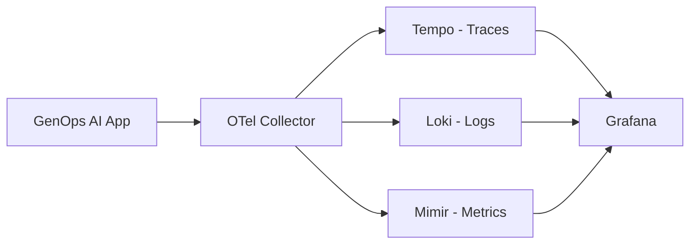

# 🔍 GenOps AI Observability Stack

Complete local observability stack for GenOps AI development and testing, featuring the **LGTM stack** (Loki, Grafana, Tempo, Mimir) with OpenTelemetry Collector.

---

## 📚 Quick Links

### Grafana-Specific Documentation
**👉 New to Grafana?** [Grafana Quickstart Guide](../docs/grafana-quickstart.md) - Get GenOps telemetry flowing to Grafana in 3-10 minutes!

**📊 Comprehensive Grafana Guide:** [Full Grafana Integration](../docs/integrations/grafana.md) - Complete reference for Grafana Cloud, self-hosted, and production deployments

**🔍 Query Examples:** [Grafana Query Cookbook](../docs/grafana-query-examples.md) - PromQL, TraceQL, and LogQL query patterns

### OpenTelemetry Collector Documentation
**👉 New to OTel Collector?** [OTel Collector Quickstart](../docs/otel-collector-quickstart.md) - Get from zero to live governance dashboards in 5 minutes!

**📖 Comprehensive OTel Guide:** [Full OTel Collector Integration](../docs/integrations/otel-collector.md) - Deep-dive into production deployment

**✅ Validate Your Setup:** Run `python examples/observability/validate_otel_collector.py` to check your configuration

---

## 🚀 Quick Start - Full LGTM Stack Deployment

**Note:** This guide covers the complete LGTM stack (Grafana + Tempo + Loki + Mimir + OTel Collector). For Grafana-specific quickstarts including Grafana Cloud and connecting to existing Grafana instances, see the [Grafana Quickstart Guide](../docs/grafana-quickstart.md).

Start the complete observability stack:

```bash
# Start all services
docker-compose -f docker-compose.observability.yml up -d

# Check service status
docker-compose -f docker-compose.observability.yml ps

# View logs
docker-compose -f docker-compose.observability.yml logs -f genops-demo
```

## 📊 Access Points

Once running, access these services:

| Service | URL | Purpose |
|---------|-----|---------|
| **Grafana** | http://localhost:3000 | Dashboards and visualization |
| **Demo App** | http://localhost:8000 | GenOps AI demo application |
| **Prometheus** | http://localhost:9090 | Metrics storage (backup) |
| **Tempo** | http://localhost:3200 | Distributed tracing backend |
| **Loki** | http://localhost:3100 | Log aggregation backend |
| **Mimir** | http://localhost:9009 | Primary metrics backend |
| **OTel Collector** | http://localhost:4318 | Telemetry collection endpoint |

**Grafana Login:**
- Username: `admin`
- Password: `genops`

## 🎯 What You Get

### 📈 **Complete Observability Pipeline**


### 🔧 **Pre-configured Services**

- **OpenTelemetry Collector**: Processes all GenOps telemetry with governance-specific transformations
- **Grafana Tempo**: Distributed tracing with GenOps span analysis
- **Grafana Loki**: Log aggregation with trace correlation
- **Grafana Mimir**: High-performance metrics storage
- **Grafana**: Pre-built GenOps AI dashboards
- **Redis**: Caching layer for demo application
- **Demo Application**: Full-featured FastAPI app showcasing GenOps integration

### 📊 **Pre-built Dashboards**

1. **GenOps AI - Governance Overview**
   - AI cost tracking by team/customer/model
   - Token usage distribution
   - Policy violation monitoring
   - Recent AI operations table

2. **Distributed Tracing**
   - Complete request flows through AI operations
   - Cost attribution per trace
   - Policy evaluation results
   - Performance bottleneck identification

## 🧪 Testing the Stack

### 0. Validate Setup (Recommended)
```bash
# Run automated validation to check all services
python examples/observability/validate_otel_collector.py

# Expected: All checks should pass with green checkmarks ✅
```

This validation script checks:
- OTel Collector health and OTLP endpoints
- Grafana, Tempo, Loki, and Mimir accessibility
- OpenTelemetry dependencies

### 1. Basic Health Check
```bash
# Test the demo application
curl http://localhost:8000/health
```

### 2. Generate AI Operations
```bash
# Single AI chat operation
curl -X POST http://localhost:8000/ai/chat \
  -H "Content-Type: application/json" \
  -d '{
    "message": "Hello, how much does this cost?",
    "model": "gpt-4",
    "team": "engineering",
    "customer_id": "test-customer",
    "max_tokens": 100
  }'

# AI analysis operation  
curl -X POST http://localhost:8000/ai/analyze \
  -H "Content-Type: application/json" \
  -d '{
    "content": "Analyze this data for insights",
    "type": "complex",
    "team": "data-science",
    "customer_id": "enterprise-123"
  }'
```

### 3. Load Testing
```bash
# Generate 50 operations for observability testing
curl -X POST http://localhost:8000/simulate/load \
  -H "Content-Type: application/json" \
  -d '{"operations": 50}'
```

### 4. View in Grafana
1. Open http://localhost:3000
2. Login with `admin/genops`
3. Navigate to "GenOps AI - Governance Overview" dashboard
4. Explore traces in the "Explore" section using Tempo

**Expected Results:**
- **AI Cost Overview panel:** Shows $0.00 initially (no operations yet)
- **After running test operation:** Cost increases to ~$0.0005 - $0.001
- **Token Usage pie chart:** Shows model name (e.g., "gpt-4") with ~100-500 tokens
- **Recent AI Operations table:** Displays your test operation with trace link
- **Policy Violations panel:** Shows 0 violations (if no policies configured)
- **Tempo Explore:** Search for your service name shows distributed traces

## 📋 Demo Application Features

The included demo application showcases real-world GenOps AI usage:

### 🎯 **AI Operations**
- **Chat endpoint** (`/ai/chat`): Conversational AI with cost tracking
- **Analysis endpoint** (`/ai/analyze`): Document/data analysis
- **Load simulation** (`/simulate/load`): Generate test data

### 🛡️ **Governance Features**
- **Cost attribution** per team, customer, and feature
- **Policy enforcement** with configurable rules
- **Budget tracking** and utilization monitoring
- **Quality evaluations** with scoring and thresholds

### 📊 **Telemetry Generated**
- **Traces**: Complete request flows with governance context
- **Metrics**: Cost, token usage, policy violations, quality scores
- **Logs**: Structured logs with trace correlation

## 🔧 Configuration

### Customizing the Stack

Edit these configuration files:

- `otel-collector-config.yaml`: Collector processing rules
- `grafana/datasources/`: Data source connections
- `grafana/dashboards/`: Dashboard definitions
- `tempo-config.yaml`: Tracing backend settings
- `mimir-config.yaml`: Metrics backend settings
- `loki-config.yaml`: Log backend settings

### Environment Variables

The demo application supports these environment variables:

```bash
# OpenTelemetry
OTEL_EXPORTER_OTLP_ENDPOINT=http://localhost:4318
OTEL_SERVICE_NAME=genops-demo
OTEL_SERVICE_VERSION=1.0.0

# Application
REDIS_URL=redis://localhost:6379
```

## 🐛 Troubleshooting

### Services Not Starting
```bash
# Check Docker resources
docker system df

# View specific service logs
docker-compose -f docker-compose.observability.yml logs grafana
docker-compose -f docker-compose.observability.yml logs otel-collector
```

### No Data in Grafana
1. Check OTel Collector is receiving data: http://localhost:8888/metrics
2. Verify demo app is sending telemetry: Generate some operations
3. Check data sources in Grafana settings

### Performance Issues
```bash
# Scale down for lower resource usage
docker-compose -f docker-compose.observability.yml up -d --scale genops-demo=0 --scale prometheus=0
```

## 🧹 Cleanup

Stop and remove all containers and volumes:

```bash
# Stop services
docker-compose -f docker-compose.observability.yml down

# Remove volumes (WARNING: deletes all data)
docker-compose -f docker-compose.observability.yml down -v

# Remove images
docker-compose -f docker-compose.observability.yml down --rmi all
```

## 💡 Next Steps

1. **Customize Dashboards**: Modify dashboard JSONs for your use case
2. **Add Alerts**: Configure Grafana alerting rules
3. **Scale Up**: Use external data stores for production
4. **Integrate**: Connect your GenOps AI applications to the collector

This observability stack provides a complete foundation for monitoring GenOps AI in development and production environments!