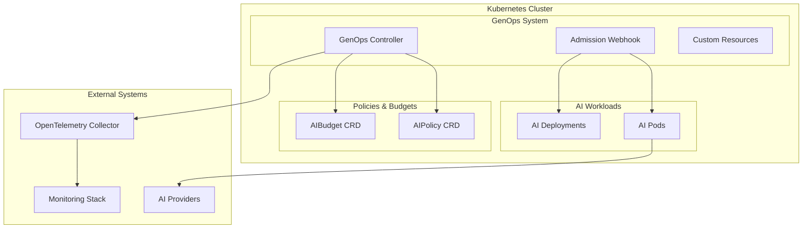

# GenOps Kubernetes Operator

A comprehensive Kubernetes operator for AI workload governance, providing policy enforcement, budget management, and observability at scale.

## Features

🎯 **AI Policy Enforcement**: Define and enforce governance policies for AI workloads  
💰 **Budget Management**: Track and control AI spending with automated alerts  
🔒 **Security & Compliance**: Content safety, data classification, and audit trails  
📊 **Multi-Provider Support**: OpenAI, Anthropic, OpenRouter, and more  
🚀 **Auto-scaling Integration**: Budget-aware scaling with custom metrics  
🔍 **Deep Observability**: OpenTelemetry integration with rich telemetry  

## Architecture



## Quick Start

### Prerequisites

- Kubernetes 1.20+
- cert-manager for webhook certificates
- OpenTelemetry Collector (optional but recommended)

### Installation

1. **Install Custom Resource Definitions**:
```bash
kubectl apply -f config/crd/bases/
```

2. **Create namespace and RBAC**:
```bash
kubectl apply -f config/rbac/
```

3. **Deploy the controller**:
```bash
kubectl apply -f config/manager/
```

4. **Set up admission webhooks**:
```bash
kubectl apply -f config/webhook/
```

### Verify Installation

```bash
# Check controller status
kubectl get pods -n genops-system

# Check CRDs are installed
kubectl get crd | grep genops.ai

# Check webhook configuration
kubectl get validatingadmissionwebhooks,mutatingadmissionwebhooks | grep genops
```

## Usage

### Creating AI Policies

Define governance policies for your AI workloads:

```yaml
apiVersion: genops.ai/v1alpha1
kind: AIPolicy
metadata:
  name: production-policy
  namespace: ai-platform
spec:
  # Cost limits
  costLimits:
    enabled: true
    daily: 100.00
    monthly: 2500.00
    currency: USD
    enforcement: throttle
  
  # Rate limiting
  rateLimits:
    enabled: true
    requestsPerMinute: 60
    requestsPerHour: 3600
    enforcement: throttle
  
  # Content safety
  contentSafety:
    enabled: true
    minimumSafetyScore: 0.85
    enforcement: block
  
  # Data classification
  dataClassification:
    enabled: true
    allowedLevels: ["public", "internal", "confidential"]
    requireClassification: true
  
  # Model governance
  modelGovernance:
    enabled: true
    allowedProviders: ["openai", "anthropic"]
    allowedModels: ["gpt-4*", "claude-3*"]
  
  # Target workloads
  selector:
    matchLabels:
      environment: production
      team: ai-platform
```

### Creating AI Budgets

Track and control AI spending:

```yaml
apiVersion: genops.ai/v1alpha1
kind: AIBudget
metadata:
  name: team-budget
  namespace: ai-platform
spec:
  # Budget allocation
  allocation:
    amount: 5000.00
    currency: USD
    period: monthly
    autoRenew: true
  
  # Cost attribution
  attribution:
    team: ai-platform
    project: chat-assistant
    costCenter: engineering
    environment: production
  
  # Usage limits
  limits:
    dailySpendLimit: 200.00
    perRequestLimit: 1.00
    requestsPerDay: 10000
  
  # Alerting
  alerts:
    enabled: true
    thresholds:
    - percentage: 50
      severity: info
    - percentage: 80
      severity: warning
    - percentage: 95
      severity: critical
  
  # Enforcement
  enforcement:
    onBudgetExceeded: throttle
    gracePeriod: 5
    approvalRequired: true
  
  # Target workloads
  selector:
    matchLabels:
      team: ai-platform
```

### Enabling Governance on Workloads

Add labels to enable governance:

```yaml
apiVersion: apps/v1
kind: Deployment
metadata:
  name: chat-assistant
  namespace: ai-platform
  labels:
    genops.ai/enable: "true"    # Enable injection
    team: ai-platform
    environment: production
spec:
  template:
    metadata:
      labels:
        genops.ai/enable: "true"
        team: ai-platform
        environment: production
    spec:
      containers:
      - name: chat-assistant
        image: my-org/chat-assistant:latest
        env:
        - name: OPENAI_API_KEY
          valueFrom:
            secretKeyRef:
              name: ai-secrets
              key: openai-key
```

Enable namespace-level governance:

```bash
# Enable policy enforcement
kubectl label namespace ai-platform genops.ai/policy-enforcement=enabled

# Enable telemetry injection
kubectl label namespace ai-platform genops.ai/injection=enabled
```

## Advanced Configuration

### Multi-Environment Policies

```yaml
# Development environment - permissive
apiVersion: genops.ai/v1alpha1
kind: AIPolicy
metadata:
  name: dev-policy
  namespace: ai-platform-dev
spec:
  costLimits:
    daily: 10.00
    enforcement: warn
  rateLimits:
    requestsPerMinute: 30
    enforcement: warn
  contentSafety:
    minimumSafetyScore: 0.7
    enforcement: warn
  selector:
    matchLabels:
      environment: development

---
# Production environment - strict
apiVersion: genops.ai/v1alpha1
kind: AIPolicy
metadata:
  name: prod-policy
  namespace: ai-platform-prod
spec:
  costLimits:
    daily: 500.00
    enforcement: block
  rateLimits:
    requestsPerMinute: 100
    enforcement: throttle
  contentSafety:
    minimumSafetyScore: 0.95
    enforcement: block
  selector:
    matchLabels:
      environment: production
```

### Per-Team Budget Allocation

```yaml
apiVersion: genops.ai/v1alpha1
kind: AIBudget
metadata:
  name: platform-team-budget
spec:
  allocation:
    amount: 10000.00
    period: monthly
  attribution:
    team: platform
  selector:
    matchLabels:
      team: platform

---
apiVersion: genops.ai/v1alpha1
kind: AIBudget
metadata:
  name: research-team-budget  
spec:
  allocation:
    amount: 2000.00
    period: monthly
  attribution:
    team: research
  limits:
    perRequestLimit: 0.50  # Lower limits for research
  selector:
    matchLabels:
      team: research
```

### Provider-Specific Policies

```yaml
apiVersion: genops.ai/v1alpha1
kind: AIPolicy
metadata:
  name: openai-policy
spec:
  modelGovernance:
    allowedProviders: ["openai"]
    allowedModels: 
    - "gpt-4-turbo*"
    - "gpt-3.5-turbo*"
    costPerToken:
      input: 0.00001   # $0.01 per 1K tokens
      output: 0.00003  # $0.03 per 1K tokens
  rateLimits:
    requestsPerMinute: 60  # OpenAI tier limits
  selector:
    matchLabels:
      ai-provider: openai

---
apiVersion: genops.ai/v1alpha1
kind: AIPolicy
metadata:
  name: anthropic-policy
spec:
  modelGovernance:
    allowedProviders: ["anthropic"]
    allowedModels:
    - "claude-3-sonnet*"
    - "claude-3-haiku*"
  rateLimits:
    requestsPerMinute: 50  # Anthropic limits
  selector:
    matchLabels:
      ai-provider: anthropic
```

## Monitoring & Observability

### Built-in Metrics

The operator exposes comprehensive metrics:

```promql
# Policy violations
genops_policy_violations_total

# Budget utilization
genops_budget_utilization_percent

# Cost tracking
genops_cost_total_usd

# Request rates
genops_requests_per_second

# Content safety scores
genops_content_safety_score
```

### Grafana Dashboard

Import the pre-built dashboard:

```bash
kubectl apply -f examples/monitoring/grafana-dashboard.yaml
```

### Alerting Rules

```yaml
apiVersion: monitoring.coreos.com/v1
kind: PrometheusRule
metadata:
  name: genops-alerts
spec:
  groups:
  - name: genops.rules
    rules:
    - alert: GenOpsBudgetExceeded
      expr: genops_budget_utilization_percent > 95
      for: 1m
      labels:
        severity: critical
      annotations:
        summary: "AI budget exceeded"
        description: "Budget {{ $labels.budget_name }} is {{ $value }}% utilized"
    
    - alert: GenOpsPolicyViolation
      expr: increase(genops_policy_violations_total[5m]) > 10
      for: 2m
      labels:
        severity: warning
      annotations:
        summary: "High policy violation rate"
```

## Security

### Webhook Security

The operator uses admission webhooks with:

- **TLS encryption** with cert-manager
- **RBAC permissions** with minimal privileges  
- **Network policies** for traffic control
- **Security contexts** with non-root users

### Policy Enforcement

- **Fail-safe defaults**: Restrictive when policies are unclear
- **Audit logging**: All policy decisions are logged
- **Gradual rollout**: Warn before blocking in production
- **Override mechanisms**: Emergency bypass capabilities

## Troubleshooting

### Common Issues

**Controller not starting:**
```bash
# Check logs
kubectl logs -n genops-system -l control-plane=controller-manager

# Check RBAC
kubectl auth can-i "*" "*" --as=system:serviceaccount:genops-system:genops-controller-manager
```

**Webhook failures:**
```bash
# Check webhook configuration
kubectl get validatingadmissionwebhooks genops-validating-webhook -o yaml

# Check certificates
kubectl get certificate -n genops-system

# Test webhook connectivity
kubectl exec -n genops-system deployment/genops-controller-manager -- \
  curl -k https://genops-webhook-service:443/healthz
```

**Policy not applying:**
```bash
# Check policy status
kubectl get aipolicy production-policy -o yaml

# Check pod labels match selector
kubectl get pods --show-labels | grep team=ai-platform

# Check controller reconciliation
kubectl logs -n genops-system -l control-plane=controller-manager | grep policy
```

### Debug Mode

Enable debug logging:

```bash
kubectl patch deployment genops-controller-manager -n genops-system -p '
{
  "spec": {
    "template": {
      "spec": {
        "containers": [
          {
            "name": "manager",
            "env": [
              {
                "name": "GENOPS_LOG_LEVEL",
                "value": "debug"
              }
            ]
          }
        ]
      }
    }
  }
}'
```

## Examples

See the [examples/](examples/) directory for:

- Multi-tenant governance patterns
- CI/CD integration examples  
- Monitoring and alerting setup
- Policy templates for common use cases
- Budget allocation strategies

## Development

### Building from Source

```bash
# Clone repository
git clone https://github.com/KoshiHQ/GenOps-AI.git
cd GenOps-AI/operators/genops-controller

# Build controller image
make docker-build IMG=genops/genops-controller:dev

# Deploy to development cluster
make deploy IMG=genops/genops-controller:dev
```

### Testing

```bash
# Run unit tests
make test

# Run integration tests
make test-integration

# Run end-to-end tests
make test-e2e
```

### Contributing

1. Fork the repository
2. Create a feature branch
3. Add tests for new functionality
4. Ensure all tests pass
5. Submit a pull request

## Support

- **Documentation**: [GenOps Kubernetes Guide](../docs/kubernetes/)
- **Issues**: [GitHub Issues](https://github.com/KoshiHQ/GenOps-AI/issues)
- **Community**: [Discussions](https://github.com/KoshiHQ/GenOps-AI/discussions)

## License

Licensed under the Apache License, Version 2.0.